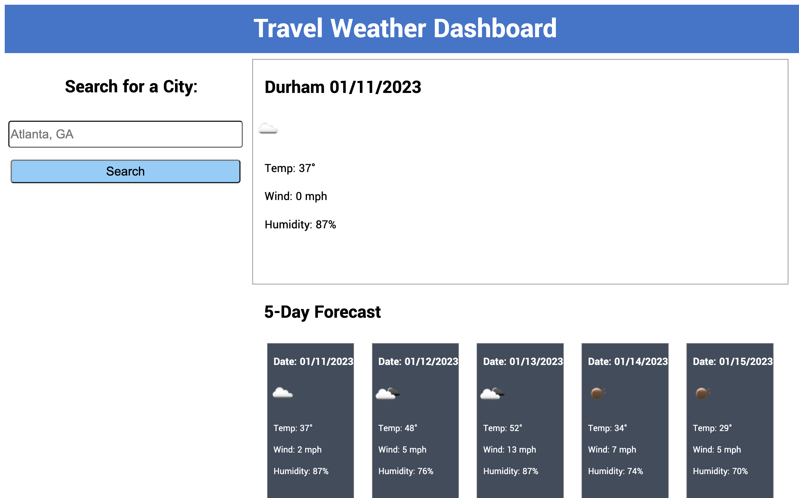
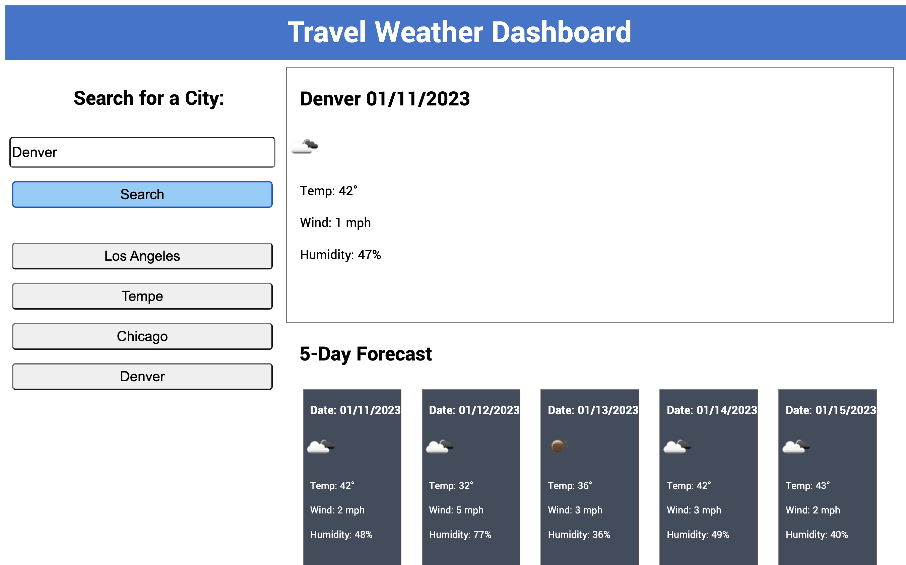
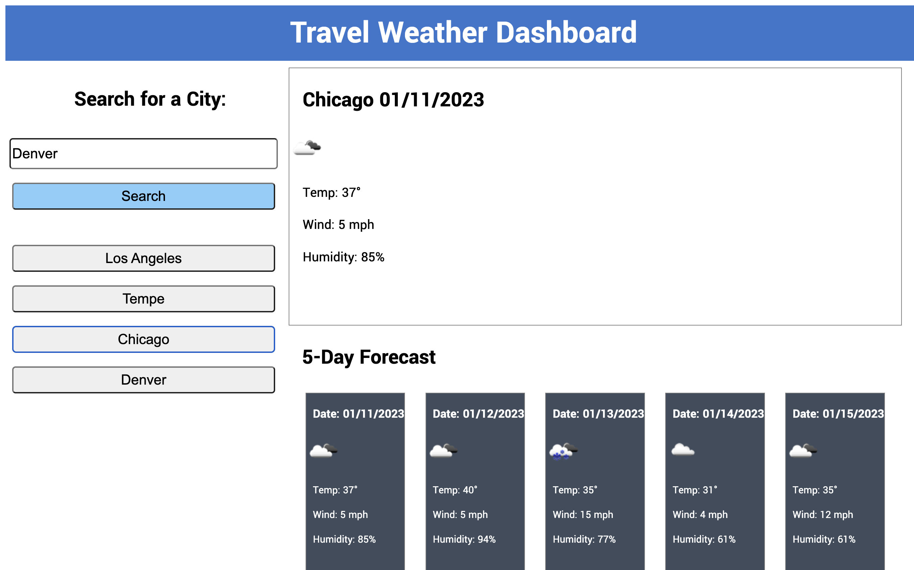

# Travel Weather Dashboard

## Project Intro
Whether you are just looking to check the weather in your hometown for the next few days or planning a trip across America, this app will provide current weather conditions for any US city as well as an updated 5-day forecast. 

## Project Goals

```
Create an app with an easy to use, intuitive interface
Allow for user input to search for cities across the US
Recall searched cities in previous sessions
Recall weather from previously searched cities
```

## Initial Display



## Search for Cities

Users can input the name of a city to see the current conditions and a 5-day forecast.



## Recall weather from previous searches

Users can click on a previously searched city to recall the current weather and a 5-day forecast.



## Live Site Link
[Live Site Link](https://andykb9b13.github.io/travel-weather-dashboard/)
